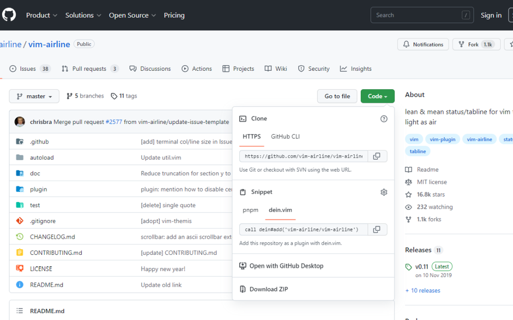

# github-snippets / Snippets section in GitHub repository
[](https://addons.mozilla.org/en/firefox/addon/github-snippets/)  



Adds "Snippets" section in GitHub repository!

> **Note**
> This extension is unofficial.

## Project Setup

```sh
pnpm install
```

## Commands
### Build
#### Development, HMR

Hot Module Reloading is used to load changes inline without requiring extension rebuilds and extension/page reloads
```sh
pnpm dev
```

#### Development, Watch

Rebuilds extension on file changes. Requires a reload of the extension (and page reload if using content scripts)
```sh
pnpm watch
```

#### Production

Minifies and optimizes extension build
```sh
pnpm build
```

### Load extension in browser

Loads the contents of the dist directory into the specified browser
```sh
npm run serve:chrome
```

```sh
npm run serve:firefox
```

## License

This extension is licensed under MIT License.

This extension uses [primer/octicons](https://github.com/primer/octicons).
```
MIT License

Copyright (c) 2022 GitHub Inc.

Permission is hereby granted, free of charge, to any person obtaining a copy
of this software and associated documentation files (the "Software"), to deal
in the Software without restriction, including without limitation the rights
to use, copy, modify, merge, publish, distribute, sublicense, and/or sell
copies of the Software, and to permit persons to whom the Software is
furnished to do so, subject to the following conditions:

The above copyright notice and this permission notice shall be included in all
copies or substantial portions of the Software.

THE SOFTWARE IS PROVIDED "AS IS", WITHOUT WARRANTY OF ANY KIND, EXPRESS OR
IMPLIED, INCLUDING BUT NOT LIMITED TO THE WARRANTIES OF MERCHANTABILITY,
FITNESS FOR A PARTICULAR PURPOSE AND NONINFRINGEMENT. IN NO EVENT SHALL THE
AUTHORS OR COPYRIGHT HOLDERS BE LIABLE FOR ANY CLAIM, DAMAGES OR OTHER
LIABILITY, WHETHER IN AN ACTION OF CONTRACT, TORT OR OTHERWISE, ARISING FROM,
OUT OF OR IN CONNECTION WITH THE SOFTWARE OR THE USE OR OTHER DEALINGS IN THE
SOFTWARE.
```

